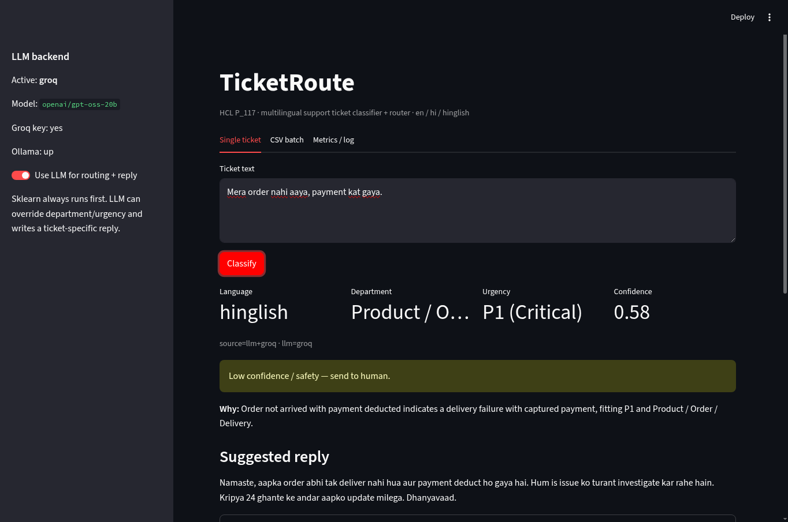

# TicketRoute

HCL internship project **P_117** — AI-Powered Customer Support Ticket Classifier.

Paste a support ticket in **English, Hindi, or Hinglish**. TicketRoute returns:

1. language tag (`en` / `hi` / `hinglish`)
2. department
3. urgency **P1–P4**
4. a first reply in the ticket’s language
5. similar past tickets
6. low-confidence or safety → send to a human

Internship demo, not a production helpdesk.

**Repo:** https://github.com/devansh-91/TicketRoute



## Features

- Streamlit UI: single ticket, CSV batch, override log
- FastAPI: `GET /health`, `POST /predict`
- Local sklearn classifiers (TF-IDF + logistic regression) — always on, offline
- Groq LLM (preferred) for ticket-specific replies and optional reroute
- Ollama fallback if no Groq key
- Similar-ticket search (TF-IDF cosine)
- Officer override saved to `data/overrides.csv` (gitignored)

## Departments and SLA

| Department | Typical tickets |
|---|---|
| Billing & Payments | double charge, refund, failed debit |
| Account / KYC / Login | lockout, PAN/KYC, OTP not arriving |
| Technical / App crash | crash, payments page, cart |
| Product / Order / Delivery | not delivered, tracking lie |
| Abuse / Safety / Fraud | phishing, OTP scam, takeover |
| Feedback / General | thanks, vague “need help” |

| Urgency | Meaning | SLA |
|---|---|---|
| P1 | Critical — fraud, takeover, payment captured / service dead | 1 hour |
| P2 | High — cannot login, failed payment, crash | 4 hours |
| P3 | Normal — delay, how-to | 24 hours |
| P4 | Low — thanks, FYI | 72 hours |

## How it works

```
ticket text
    → language tag (script + Hinglish lexicon)
    → sklearn: department + urgency + confidence
    → similar tickets (TF-IDF)
    → Groq (or Ollama): JSON triage + reply in ticket language
    → Streamlit / FastAPI
    → human override log
```

Sklearn always runs. LLM can override labels and writes the reply. If the LLM times out, templates still reply.

## Project structure

```
TicketRoute/
├── app.py                 # Streamlit UI
├── api.py                 # FastAPI
├── requirements.txt
├── .env.example           # copy to .env — never commit .env
├── LICENSE
├── ticketroute/           # library
│   ├── taxonomy.py        # departments, SLA, abstain threshold
│   ├── language.py        # en / hi / hinglish
│   ├── preprocess.py
│   ├── generate_data.py   # synthetic tickets
│   ├── train.py           # fit sklearn models
│   ├── predict.py         # sklearn + LLM fusion
│   ├── llm.py             # Groq then Ollama
│   ├── reply.py           # templates if no LLM
│   ├── similar.py         # nearest labelled tickets
│   └── config.py          # loads .env
├── data/
│   └── tickets.csv        # labelled synthetic set
├── models/                # department.joblib, urgency.joblib
├── tests/                 # pytest (no API key required)
├── docs/
│   ├── ARCHITECTURE.md
│   ├── HCL_P117_SPEC.txt  # original internship brief
│   └── assets/ui-demo.png
├── reports/               # train metrics
├── scripts/
│   ├── run_ui.sh
│   └── run_api.sh
└── .github/workflows/ci.yml
```

## Setup

Python 3.11+ recommended.

```bash
git clone https://github.com/devansh-91/TicketRoute.git
cd TicketRoute
python3 -m venv .venv
source .venv/bin/activate
pip install -r requirements.txt
cp .env.example .env
```

Edit `.env`:

```
GROQ_API_KEY=gsk_...
GROQ_MODEL=openai/gpt-oss-20b
```

`.env` is gitignored. Do not commit keys.

Optional: regenerate data and models.

```bash
python3 -m ticketroute.generate_data
python3 -m ticketroute.train
python3 -m pytest tests/ -q
```

Trained joblib files are already in `models/` so train is optional for a first run.

## Run

UI:

```bash
bash scripts/run_ui.sh
# http://127.0.0.1:8501
```

API:

```bash
bash scripts/run_api.sh
# http://127.0.0.1:8000/health
```

Predict:

```bash
curl -sS -X POST http://127.0.0.1:8000/predict \
  -H 'Content-Type: application/json' \
  -d '{"text":"Mera order nahi aaya, payment kat gaya.","use_llm":true}'
```

Without Groq, leave `GROQ_API_KEY` empty. The UI still classifies locally. If Ollama is running (`llama3.2:3b` by default), replies can come from there.

## Environment

| Variable | Default | Purpose |
|---|---|---|
| `GROQ_API_KEY` | empty | Groq key (preferred LLM) |
| `GROQ_MODEL` | `openai/gpt-oss-20b` | must exist on your Groq account |
| `OLLAMA_HOST` | `http://127.0.0.1:11434` | local fallback |
| `OLLAMA_MODEL` | `llama3.2:3b` | local chat model |
| `LLM_TIMEOUT` | `20` | seconds |

## Tests

```bash
python3 -m pytest tests/ -q
```

CI runs the same on GitHub Actions. Tests cover language, templates, JSON validation, and sklearn predict (`use_llm=false`). They do not need a Groq key.

## Honest limits

Held-out accuracy on the synthetic CSV is near 1.0 because the templates are small. That is memorisation, not a real desk score. Do not quote it as production F1.

Next steps: noisy real tickets, MuRIL encoder, FAISS similar-search, FastAPI auth.

## License

MIT — see `LICENSE`.
